Курс Adalm-Pluto SDR

### task1 - основы, генерация сигнала в реальном времени

### task2 - Формирование сигналов, визуализация в Python. 

    test_list.py - Сравнение скорости работы lists и NumPy

    test_plot.py - Создание графиков с различным стилем отображения

### task3 - Изучение основных параметров библиотеки PyAdi для Adalm Pluto SDR

    Определение наисильнейшего сигнала - 2412 Мгц
    Передача данных на данной частоте

    Практика
    Практическое занятие по разделу Дискретизация сигналов

        Значение аналоговой частоты сигнала при частоте дискретизации = 1000 отсчетов/c, которая соответствует нормированной частоте Ω=0.4π рад равна 200 Гц

        Временные диаграммы 

        Частота дискретизации 500 отсчетов/с
        Количество отсчетов сигнала порядка 200 в команде arrange

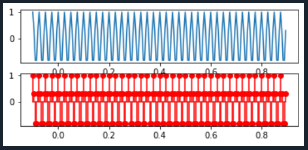

        fft

### task4 - Изучение основных свойств ДПФ с помощью моделирования в  Python/Spyder

    ds_Fourier.py - дискретное преобразование Фурье
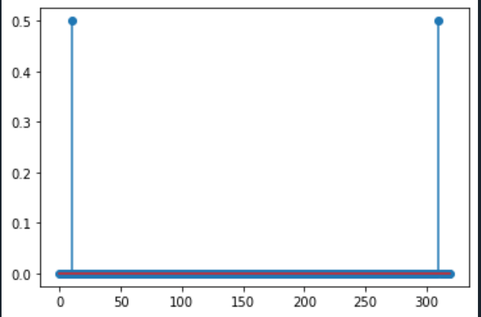
    prtask2.py - Преобразование Фурье к сигналу полученному от Adalm_Pluto_SDR

    1. Для заданных значений частоты сигнала и частоты дискретизации получите дискретное колебание, отсчеты посмотрите в Variable Explorer. Далее увеличьте частоту сигнала в несколько раз, при этом так же увеличится и частота дискретизации, но отношение частоты сигнала и частоты дискретизации - нормированная частота останется той же величиной.
    Сравните дискретные отсчеты первого и второго сигналов.
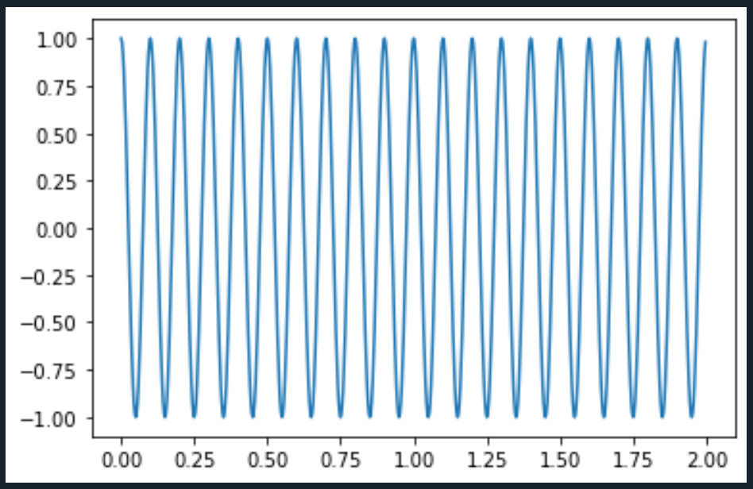

    2. Вычислите шаг частот между точками ДПФ ∆f =fs/N. Определите, в
    какой точке ДПФ находится заданный сигнал.
    fs = 320, N = 256
    ∆f = fs/N = 1.25 
    fс = 20, частота сигнала
    dpf = fc / ∆f = 16

    3. Измените частоту сигнала в целое чисто раз, определите номер точки
    ДПФ для данного сигнала.
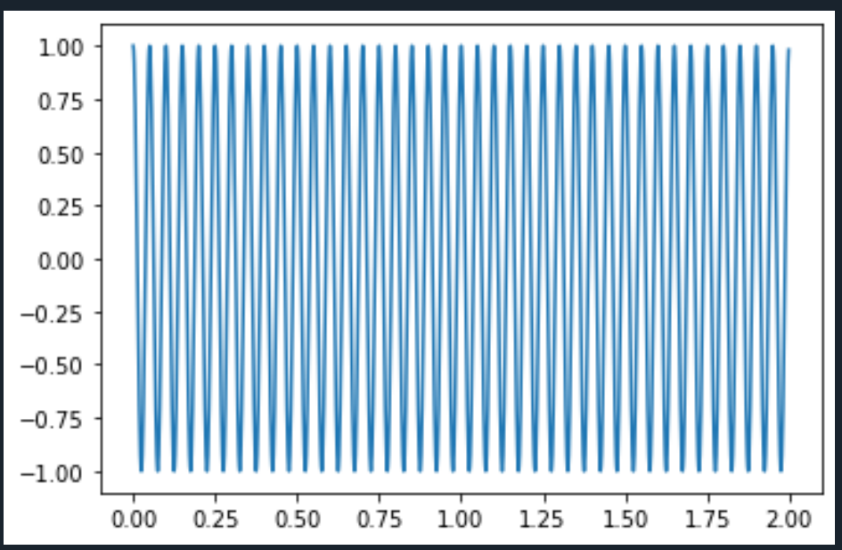

    4. Измените количество точек ДПФ до 512. Вычислите шаг частот между
    точками ДПФ ∆f = fs/N. Определите, в какой точке ДПФ находится заданный сигнал.

    5. Задайте сигнал в виде суммы двух колебаний. Вычислите ДПФ сигнала.

    6.  Вычислите ОДПФ сигнала, заданого в частотной области в виде X=np.array([0,0,1,0,0,0,0,0]).
    Задавайте ненулевое значение в различных разрядах. Также задайте значение в комплексной форме X=np.array([0,0,1j,0,0,0,0,0]), поменяйте знак
    мнимой единицы, задайте спектр ДПФ в виде X=np.array([0,0,2-1j,0,0,0,0,0])
    поменяйте знак мнимой единицы. Можно увеличить количество точек до
    16 при одном ненулевом значении.

    X=np.array([0,0,1,0,0,0,0,0]) - 1 график
    X=np.array([0,0,1,0,0,0,1,1]) - 2 график

    X=np.array([0,0,1j,0,0,0,0,0]) - 1 график
    X=np.array([0,0,-1j,0,0,0,0,0]) - 2 график
    
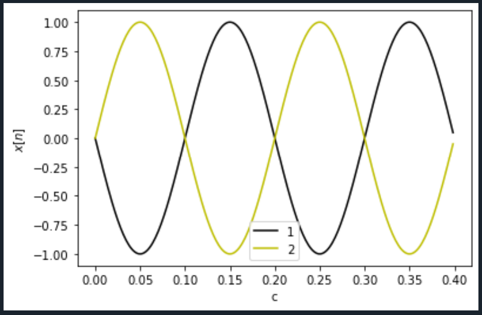

    X=np.array([0,0,2+1j,0,0,0,0,0]) - 1 график
    X=np.array([0,0,2-1j,0,0,0,0,0]) - 2 график

    X=np.array([0,0,2+1j,0,0,0,0,1,1j,0,0,2,1,1,1,0])

### task5 - Передача/прием sin() сигнала. Реализация АМ модуляции. PlutoSDR.

    Передача одиночного сигнала

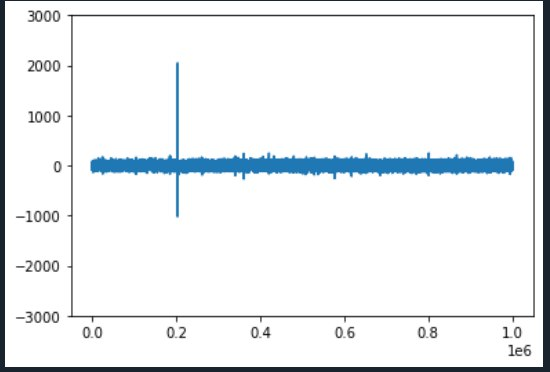

    Передача двоичного кода символа
    В данном случае передана последовательность: 0101010101

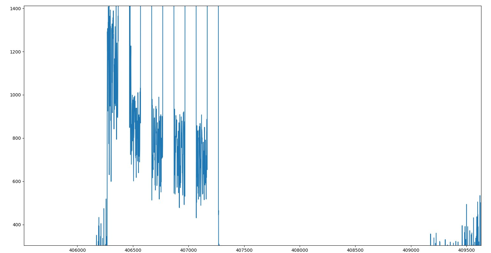

    Передача двоичного кода символа с сообщением синхронизации
    В данном случае передана последовательность: 11111111110101010101

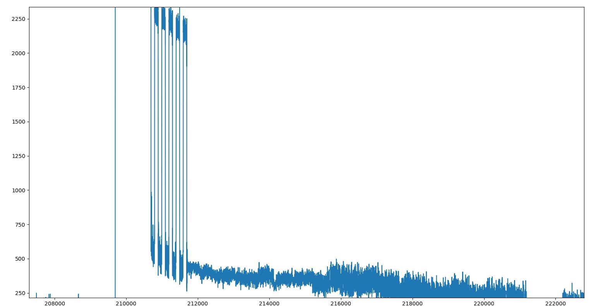

### task6 - Модуляции QPSK, QAM. Раздельный приём и передача на SDR

    file1.py - Программа взятая за основу (Моделирование сигнала, накладывание шума, декодирование)
    

Графики file1.py

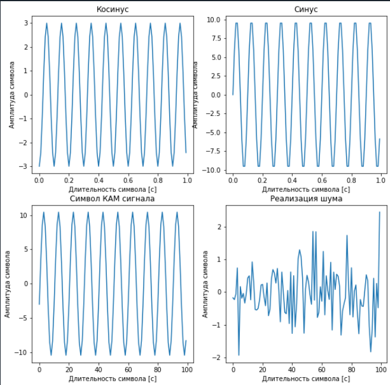
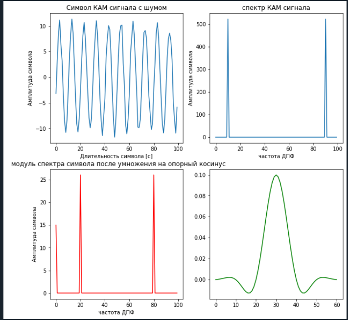

    file2.py - Отправленный и полученный сигнал соответственно

    file3.py - спектр полученного сигнала

    file4_e3.py - другой вид представления полученного сигнала
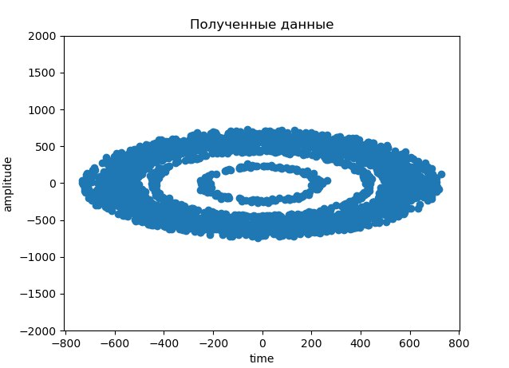

### task7 - 

    file1.py - программа способная работать как передатчик так и отправитель сигнала
    Сформированный сигнал

    Полученный сигнал

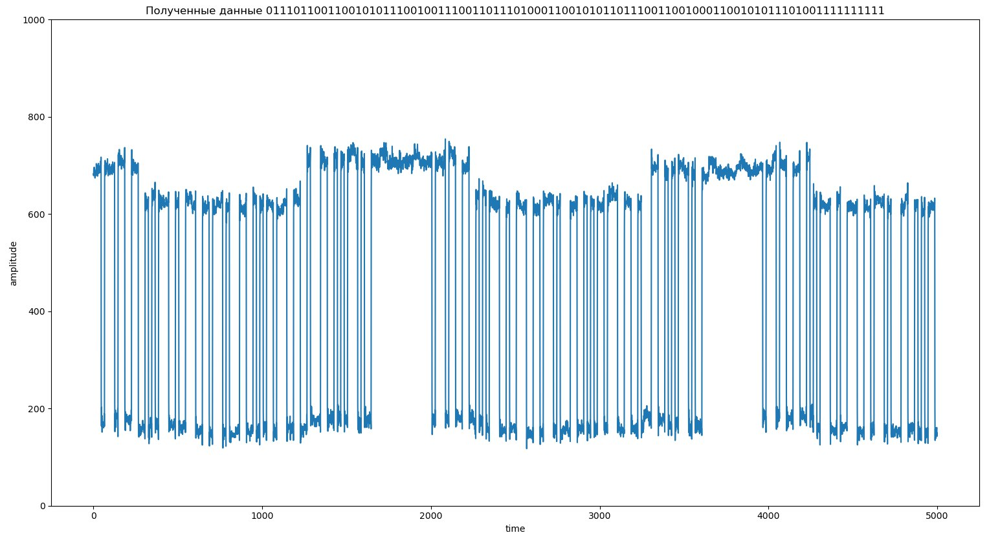    

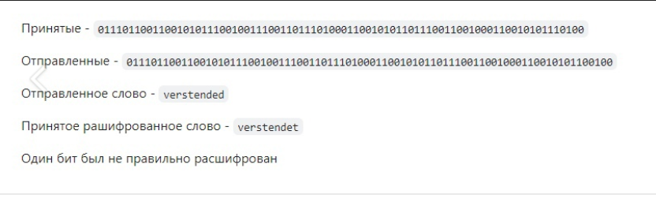 

